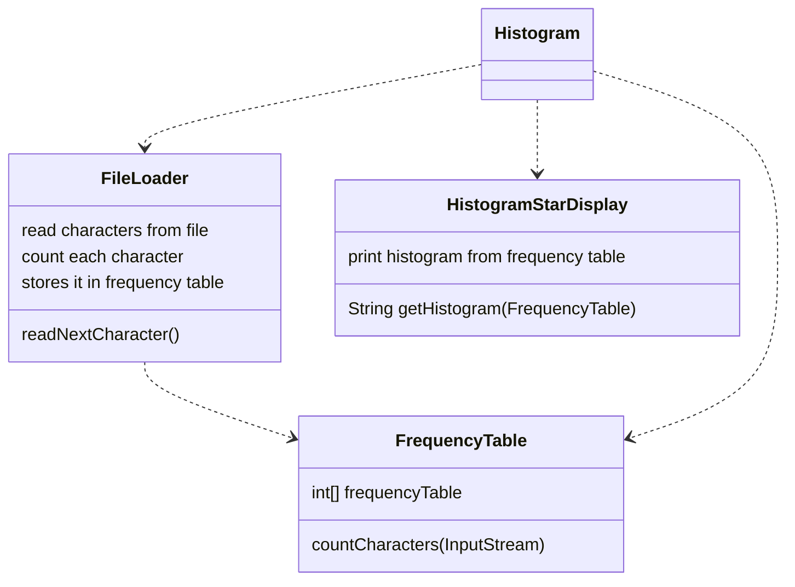

```mermaid


classDiagram
    Histogram ..> FileLoader
    Histogram ..> HistogramStarDisplay

    class HistogramStarDisplay{
       print histogram from frequency table
       String getHistogram(FrequencyTable)
    }   
    class FileLoader{
        read characters from file
        count each character
        stores it in frequency table
        readNextCharacter()
    }
    FileLoader ..> FrequencyTable
    Histogram ..> FrequencyTable
    class FrequencyTable{
        int[] frequencyTable
        countCharacters(InputStream)
    }


```